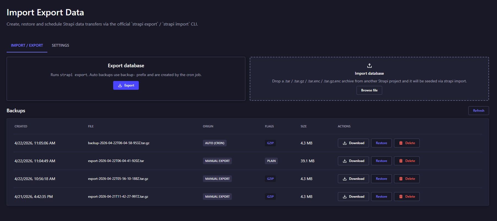
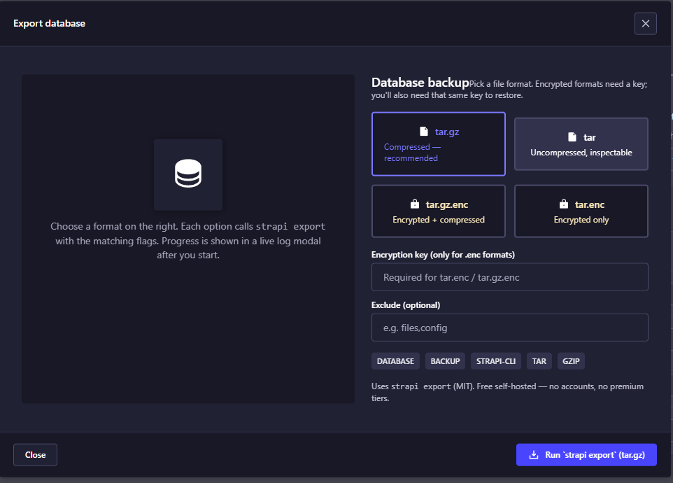
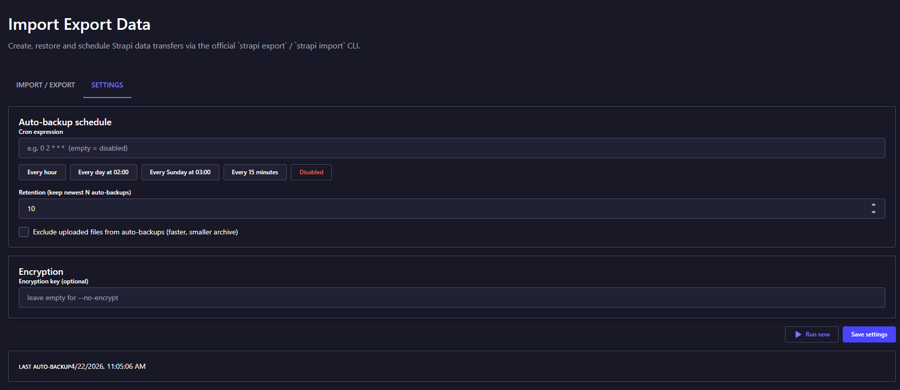

# Import Export Data

A **Strapi 5** plugin that wraps the official `strapi export` / `strapi import` CLI
in an admin UI and adds per-collection CSV/JSON/XLSX export plus scheduled,
retention-aware auto-backups.

- **Version:** `5.0.0`
- **Strapi:** `^5.0.0`

---

## Features

- **Create / restore / download / delete** full project archives (`tar`, `tar.gz`,
  `tar.enc`, `tar.gz.enc`) from the admin.
- **Import** an archive from another project by drag-and-drop.
- **Per-collection export** in the Content Manager list view
  (Quick export in CSV/JSON/XLSX or Data Explorer with column picker & filters).
- **Per-collection import** of CSV/JSON/XLSX from the same list view.
- **Scheduled auto-backups** via cron, with retention, optional encryption key
  and an option to exclude uploaded files.
- **One-click "Run now"** to trigger the scheduled backup immediately.
- Live job-progress log for every export / import / restore.
- Auth state is preserved across restores — you do not get logged out.

---

## Install

```bash
npm install import-export-data
# or
yarn add import-export-data
```

Enable it in `config/plugins.js`:

```js
module.exports = () => ({
  "import-export-data": { enabled: true },
});
```

### Raise the body-size limit (IMPORTANT for uploads)

Archives are uploaded via multipart. There are **two independent** layers that
can reject a large upload with `413 Payload Too Large`. Both must be raised or
the UI will show `Unexpected token '<', "<html> <h"... is not valid JSON`:

#### 1. Strapi — `admin/config/middlewares.js`

Replace the bare `"strapi::body"` entry with an object form:

```js
module.exports = [
  "strapi::errors",
  "strapi::poweredBy",
  "strapi::logger",
  "strapi::query",
  {
    name: "strapi::body",
    config: {
      jsonLimit: "512mb",
      formLimit: "512mb",
      textLimit: "512mb",
      formidable: { maxFileSize: 2 * 1024 * 1024 * 1024 }, // 2 GB
    },
  },
  "strapi::session",
  // ...rest
];
```

Restart Strapi after the change — config is read only at boot.

#### 2. Reverse proxy (nginx / traefik / Cloudflare)

If any proxy sits in front of Strapi, raise its body-size limit too — it will
reject the upload **before** it reaches Strapi, so Strapi logs stay empty and
only the browser sees the HTML 413 from the proxy.

**nginx** — inside each `http { ... }` block (all configs in `proxy/`):

```nginx
client_max_body_size 2g;
client_body_buffer_size 1m;
proxy_request_buffering off;     # stream the upload; don't buffer the whole body in RAM
proxy_read_timeout 1800s;        # 30 min for very large archives
proxy_send_timeout 1800s;
```

Restart the nginx container (`docker compose restart proxy`) after the change.

**traefik** — set `buffering.maxRequestBodyBytes` on the router middleware.

**Cloudflare** — the free plan hard-caps uploads at 100 MB. Upgrade or bypass
Cloudflare for the admin subdomain if your archives exceed it.

#### Troubleshooting

| Symptom                                          | Layer to fix                       |
| ------------------------------------------------ | ---------------------------------- |
| Browser shows `Unexpected token '<'`, no log     | Check nginx/proxy `413` response   |
| Strapi log shows `PayloadTooLargeError`          | Raise `strapi::body` limits        |
| Upload hangs and times out                       | Raise `proxy_read_timeout` in nginx |
| Works locally, fails via proxy only              | Proxy `client_max_body_size` too low |

**Rule of thumb:** proxy limit must be **≥** Strapi `formidable.maxFileSize`.
Match them in both places — if you raise one and not the other, the lower wins.

### Ignore backups from the admin watcher

Backups are written to `data/backups/`. Without an ignore rule the Strapi admin
dev server restarts every time a new archive lands. Add the following to
**`admin/config/admin.js`**:

```js
module.exports = ({ env }) => ({
  // ...your existing admin config
  watchIgnoreFiles: [
    "**/data/backups/**",
    "**/data/*.tar",
    "**/data/*.tar.gz",
    "**/data/*.tar.enc",
    "**/data/*.tar.gz.enc",
    "**/.plugin-config.json",
  ],
});
```

---

## UI

### Home page — Import / Export tab

Create an export, drop an archive to import, and manage existing backups
from one table.



### Export modal

Pick an archive format, optionally supply an encryption key, and exclude
any part (`files`, `config`, `content`) via the CLI flag.



### Settings tab

Configure the cron schedule, retention, encryption key and auto-exclude
option. The **Enabled / Disabled** pill next to the cron presets is green
when the schedule is active and red when it is off — one click toggles it.



---

## Storage

Archives live under `<strapi-root>/data/backups/`. Plugin settings are
persisted in `<strapi-root>/data/backups/.plugin-config.json`.

Add `data/backups/` to `.gitignore`.

---

## Permissions

All routes are admin-only. The plugin reuses the Content Manager's
permission checker, so per-collection export/import requires the
corresponding `read` / `create` / `update` permission on the target
content type.

---

## License

MIT
